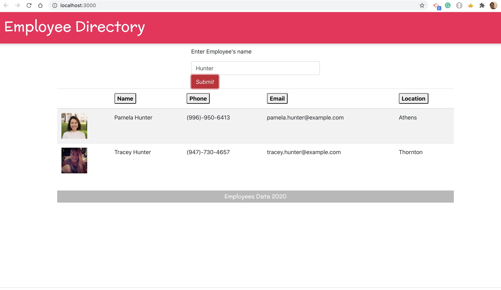
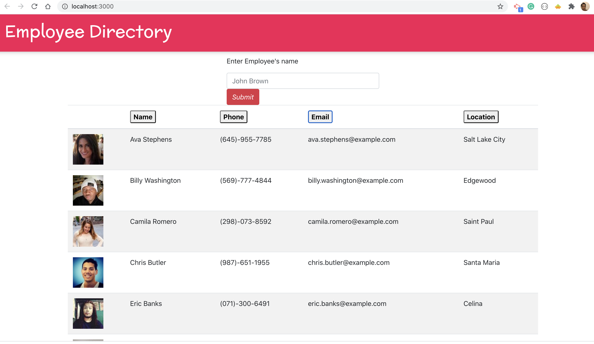
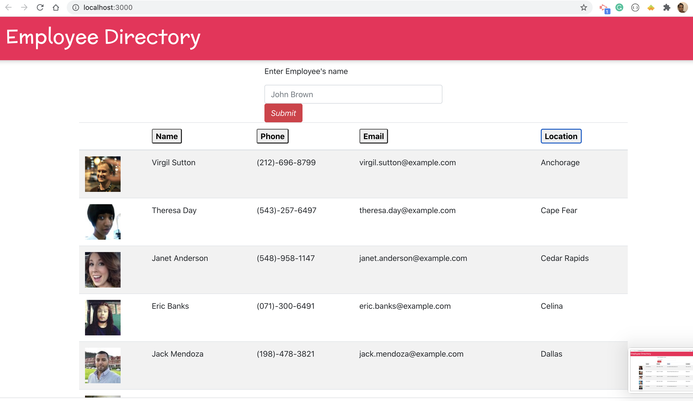
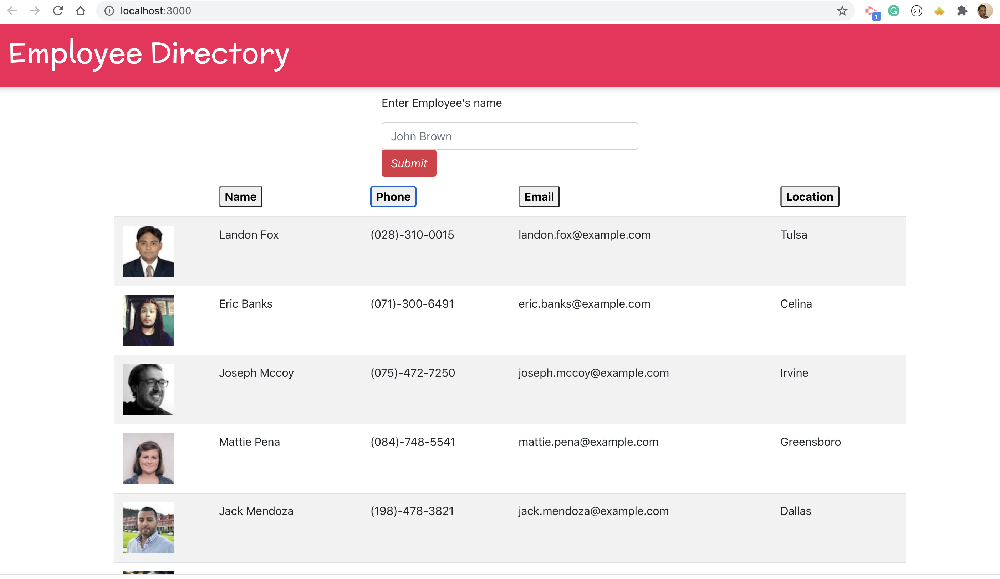
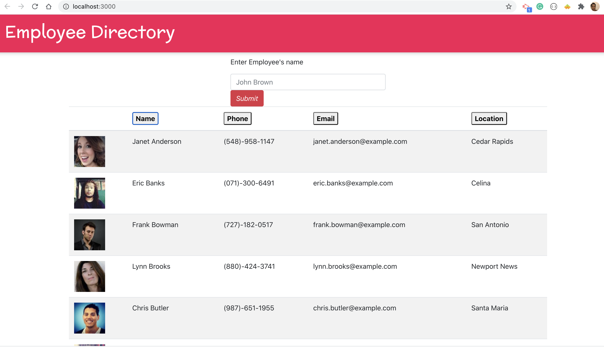

#  Project Title: Employee_Directory

## Badges: 

 

## User Story 

* As a user, I want to be able to view my entire employee directory at once so that I have quick access to their information. 

## Technology

- Reactjs

## Description: 

* Create a employee directory with Reactjs. The application's UI should be broken up into components, manage component state, and respond to user events.

* The app should be able to:

Given a table of random users, when the user loads the page, a table of employees should render.
    - The user should be able to sort the table by at least one category
    - Filter the users by at least one property

## Table of Content: 

* [Installation](#installation)  
* [Usage](#usage)
* [License](#license)
* [Contributors](#contributors)
* [Tests](#tests)
* [Questions](#questions)
* [Link](#links)
* [Images](#images)

## Installaion:
* npm i
* npm run start

## License: 
* MIT
# Contributing: 
* Pull request and stars are always welcome.
## Testing: 
* N/A

## Questions
If you have any questions, please contact at:   
Email: carolenesw@gmail.com

## link

* Repo link:
https://github.com/Carolenesw/Employee_Directory

* Deployed URL: 
https://employee-directory2020.herokuapp.com/

## Images

* Search By Last Name

* Sort by Email

* Sort by Location

* Sort by Phone

* Sort by Last Name

